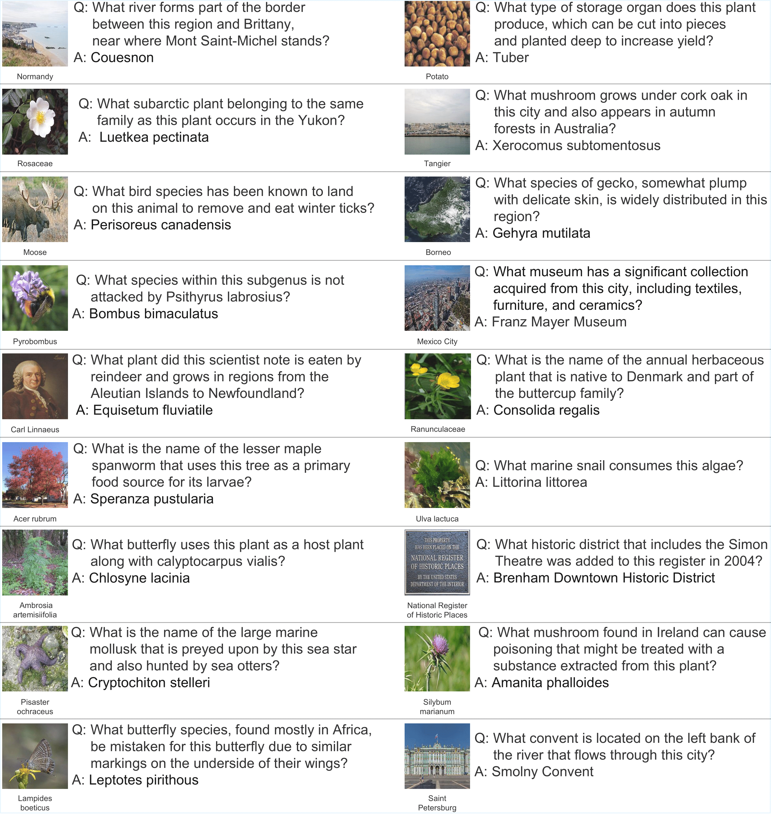

<br><br>

<p align="center">
  &nbsp;&nbsp;&nbsp;
  &nbsp;&nbsp;&nbsp;
  &nbsp;&nbsp;&nbsp;
  &nbsp;&nbsp;&nbsp;
</p>

<br>

# <p align="center">Breaking the Visual Shortcuts in Multimodal Knowledge-Based Visual Question Answering</p>

<p align="center">
  <a href="https://arxiv.org/abs/2511.22843">arXiv</a> | <a href="https://leeds1219.github.io//RETINA">Project</a>
</p>

<p align="center">
  by <a href="https://leeds1219.github.io/">Dosung Lee</a>,
  <a href="https://successful-humor-4db.notion.site/Sangwon-Jung-70109a49767a470092a6ee0d02c78313">Sangwon Jung</a>,
  <a href="https://bykimby.github.io/">Boyoung Kim</a>,
  <a href="https://github.com/EuroMinyoung186">Minyoung Kim</a>,
  <a href="https://sung-yeon-kim.github.io/">Sungyeon Kim</a>,
  <a href="https://www.linkedin.com/in/joonyeongs/">Junyoung Sung</a>,
  <a href="https://miil.korea.ac.kr/">Paul Hongsuck Seo</a>
</p>

## ✨ RETINA: Relational Entity Text-Image kNowledge Augmented Benchmark

This repository provides the **RETINA** benchmark, a novel and large-scale dataset for **Multimodal Knowledge-Based Visual Question Answering (MKB-VQA)**.

RETINA was introduced to overcome a critical limitation in existing MKB-VQA datasets: the **"visual shortcut."** Models could often succeed by simply matching the query image to the target document's primary subject entity.

## 🚀 Key Feature: Breaking the Shortcut

RETINA is explicitly designed to eliminate this bias, forcing models to rely on true relational knowledge.

The benchmark's construction process ensures that the **query image** is of a **secondary, related entity** mentioned in the document, rather than the main subject. 

For instance, given a question "What animal mainly eats this fruit?" with an image of an apple, the answer might be in the document about "Bears" not "apples".

This setup reflects complex, real-world scenarios where knowledge retrieval must go beyond direct visual matching.



## 💾 Dataset Access
**- [] (Status: Cleaning up the path and adding image)**

The RETINA bench, including the large training set and the human-curated test set, is available for download and use on Hugging Face:

[**Access the RETINA Dataset**](https://huggingface.co/datasets/Lee1219/RETINA)

For EVQA and Infoseek, including the query images and textual KB, please refer to [Lin Weizhe et al.](https://arxiv.org/abs/2402.08327):

[**Access the M2KR Dataset**](https://github.com/LinWeizheDragon/FLMR/tree/main)

For the document images please refer to [Lianghao Deng et al.](https://github.com/lhdeng-gh/MuKA).

### Statistics

| Component | Size | Note |
| :--- | :--- | :--- |
| **Training Set** | 120k samples | Automatically generated via an LLM-driven pipeline. |
| **Test Set** | 2k samples | Human-curated. |

## ⚖️ Acknowledgements
We build apon [LinWeizheDragon/FLMR](https://github.com/LinWeizheDragon/FLMR/tree/main) and [lhdeng-gh/MuKA](https://github.com/lhdeng-gh/MuKA)
For image verification we use [Imagehash toolkit](https://github.com/jenssegers/imagehash).
The RETINA dataset is intended for **non-commercial research purposes**. Users are solely responsible for any and all utilization of the dataset. 
The creators of this benchmark and their affiliated institutions shall not be held liable for any damages, consequences, or legal issues that may arise from its use.

```
@misc{lee2025breakingvisualshortcutsmultimodal,
      title={Breaking the Visual Shortcuts in Multimodal Knowledge-Based Visual Question Answering}, 
      author={Dosung Lee and Sangwon Jung and Boyoung Kim and Minyoung Kim and Sungyeon Kim and Junyoung Sung and Paul Hongsuck Seo},
      year={2025},
      eprint={2511.22843},
      archivePrefix={arXiv},
      primaryClass={cs.CV},
      url={https://arxiv.org/abs/2511.22843}, 
}
```
